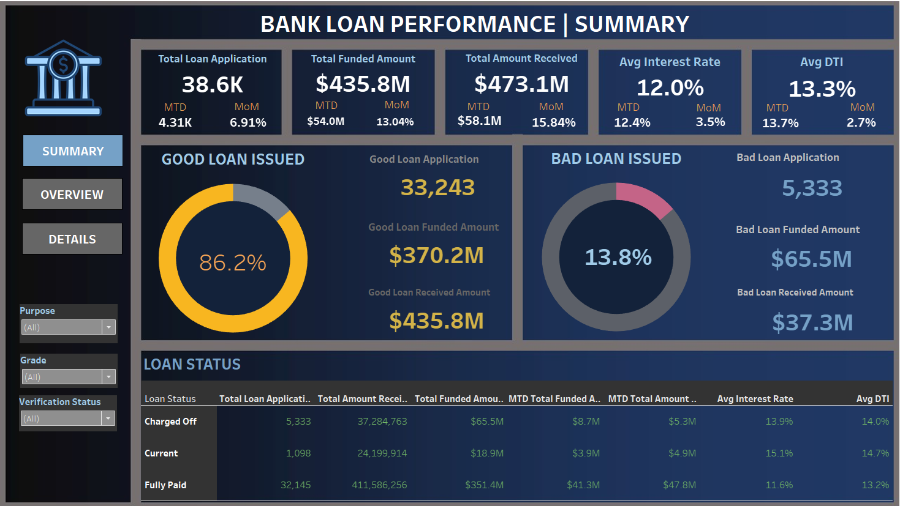
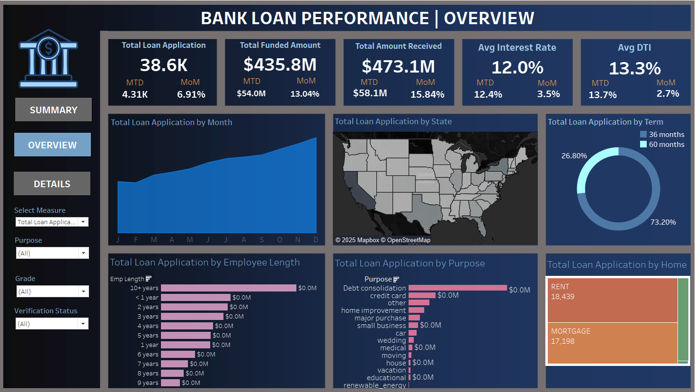
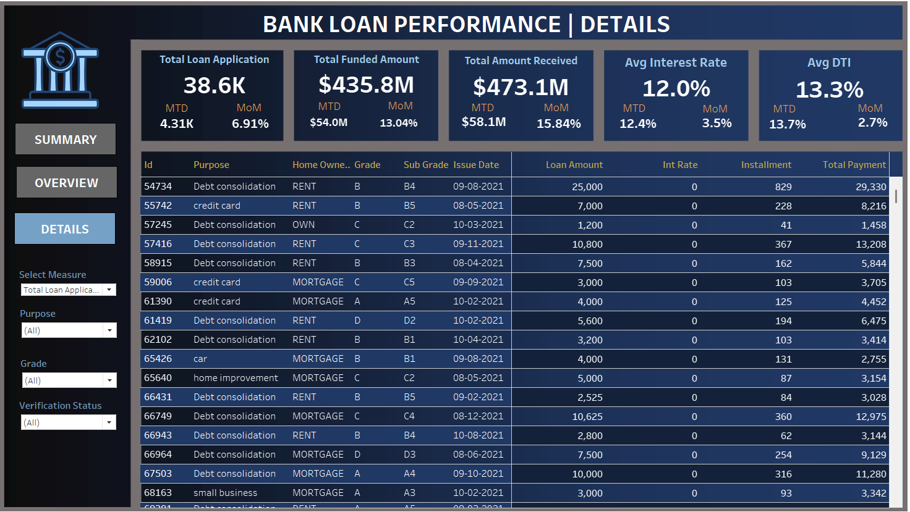

# 🏦 Bank Loan Performance Dashboard (MTD vs PMTD Analysis)

### 📘 Project Overview
This project analyzes a **bank’s loan portfolio** to uncover key performance metrics such as loan applications, funded amounts, repayments, and borrower profiles.  
It aims to help financial analysts and credit officers assess **loan performance, profitability, and risk exposure** based on data-driven KPIs.

The dashboard presents an end-to-end **loan performance summary** using **SQL** for data processing and **Tableau** for visualization.

---

### 🎯 Objectives
- Measure **total and monthly loan applications (MTD vs PMTD)**  
- Track **funded vs. received loan amounts**  
- Analyze **good vs. bad loans** and repayment efficiency  
- Evaluate **average interest rate** and **debt-to-income (DTI)** ratio  
- Provide breakdowns by **state, term, purpose, home ownership, and employment length**

---

### 💡 Solution Approach
1. **Data Extraction (SQL Server)**  
   - Queried the `bank_loan_data` table to compute KPIs such as:
     - Total applications  
     - Total funded and received amounts  
     - Good/Bad loan ratios  
     - Monthly trends and state-level data  
   - Used **CTEs, aggregations, and filtering (MTD & PMTD)** for comparative analysis.  

2. **Visualization (Tableau)**  
   - Designed a **3-page interactive dashboard**:
     - **Summary:** Loan health overview (Good vs. Bad loans)
     - **Overview:** Funding, repayments, and loan trends
     - **Details:** Transaction-level drill-down table  
   - Used parameters, filters, and color-coded KPIs for an executive-friendly view.

---

### 🧾 Dataset Summary
| Column | Description |
|---------|-------------|
| `id` | Unique Loan Identifier |
| `issue_date` | Date loan was issued |
| `loan_amount` | Principal loan amount |
| `total_payment` | Amount repaid by borrower |
| `int_rate` | Interest rate of the loan |
| `dti` | Debt-to-Income ratio |
| `loan_status` | Loan outcome (Fully Paid, Current, Charged Off) |
| `emp_length` | Borrower employment duration |
| `purpose` | Purpose for which loan was taken |
| `address_state` | Borrower’s state |
| `home_ownership` | Home ownership type (Rent, Mortgage, Own) |

---

### 📊 Dashboard Pages

#### 🔹 1. Summary View
- Highlights **Good vs. Bad Loan Distribution**
- Displays:
  - Total Loan Applications: **38.6K**
  - Total Funded Amount: **$435.8M**
  - Total Amount Received: **$473.1M**
  - Avg Interest Rate: **12.0%**
  - Avg DTI: **13.3%**

---

#### 🔹 2. Overview Page
- Visualizes overall performance trends:
  - Total loan applications by **month, state, term, and purpose**
  - KPIs comparing **MTD vs MoM** (Month-over-Month)
  - Insights into loan distribution across borrower attributes

---

#### 🔹 3. Details Page
- Transaction-level insights for analysts:
  - Filters by purpose, grade, and verification status  
  - Displays issue date, loan amount, rate, installment, and repayment  

---

### 📈 Key Metrics
| Metric | Description | Value |
|--------|--------------|-------|
| **Total Loan Applications** | Total number of loans issued | 38,600 |
| **MTD Loan Applications** | Current month’s applications | 4,310 |
| **Total Funded Amount** | Loans disbursed by the bank | $435.8M |
| **Total Amount Received** | Total repayment collected | $473.1M |
| **Good Loan %** | Fully Paid + Current loans | 86.2% |
| **Bad Loan %** | Charged-Off loans | 13.8% |
| **Avg Interest Rate** | Average loan interest | 12.0% |
| **Avg DTI** | Borrower debt ratio | 13.3% |

---

### 🔍 Insights
- **Good loans (86%)** dominate the portfolio — strong repayment performance.  
- **December** recorded the **highest loan issuance and repayment**, suggesting seasonal lending peaks.  
- **Average interest rate** is stable around **12%**, showing controlled lending risk.  
- **Charged-off loans (13.8%)** concentrated in certain states — potential risk management focus area.  
- Majority of loans are **36-month terms (73%)**, indicating shorter repayment preference.

---

### 🧰 Tools & Technologies
- **SQL Server Management Studio (SSMS)** – Data querying & aggregation  
- **Tableau** – Dashboard design and visualization  
- **Excel/CSV** – Data preprocessing and export  
- **GitHub** – Version control and project documentation  

---

### 📁 Files in Repository
| File | Description |
|------|--------------|
| `Bank_Loan_Analysis_Report.pdf` | Full analysis with problem, SQL queries, and results |
| `Bank_Loan_Dashboard.twbx` | Tableau packaged workbook |
| `bank_loan_data.csv` | Dataset used for analysis |
| `dashboard_1.png`, `dashboard_2.png`, `dashboard_3.png` | Dashboard screenshots |
| `README.md` | Project documentation (this file) |

---

### 🌐 View the Interactive Dashboard
👉 **[View on Tableau Public]((https://public.tableau.com/views/YourDashboardLinkHere](https://public.tableau.com/views/BankLoanDashboard_17605457873150/DETAILS?:language=en-US&:sid=&:redirect=auth&:display_count=n&:origin=viz_share_link))**

---

### 👨‍💻 Author
**Jaykumar Patel**  
📍 *Master of Applied Computing, University of Windsor*  
🔗[GitHub](https://github.com/Jay03112000)

---

### 🏁 Summary
This project showcases an end-to-end **data analytics workflow** — from SQL data extraction to Tableau visualization — providing actionable insights into the bank’s lending performance.  
It demonstrates skills in **data wrangling, business intelligence, and visualization storytelling** for real-world financial analytics.
